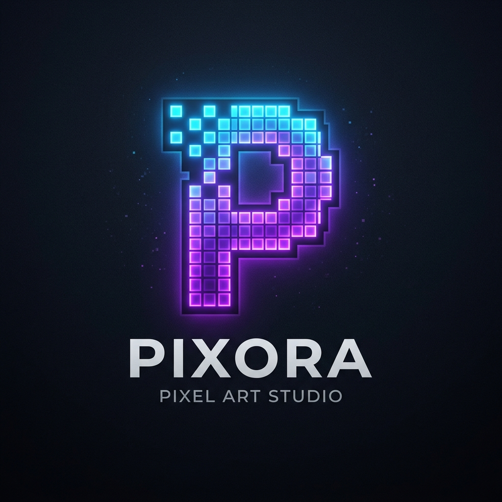

<div align="center">
  
  <h1>Pixora - Beta Verison v5.1</h1>
  <p><strong>A blazingly fast, privacy-first, web-based Pixel Art Studio.</strong></p>
  
  [](LICENSE)
  [](#)
  [](#)
</div>

<hr/>

## 🚀 Tính năng nổi bật (Features)

*   **🎨 Giao diện tuyệt đẹp (Glassmorphism UI):** Thiết kế chuyên nghiệp, trong suốt và hiện đại mang cảm hứng vũ trụ.
*   **⚡ Tốc độ bàn thờ (Blazing Fast):** Chạy 100% trên trình duyệt (HTML5 Canvas), cực kỳ nhẹ, không cần cài đặt.
*   **🛠️ Công cụ thông minh (Smart Tools):** Cung cấp các công cụ như Dithering, Symmetry (đối xứng), Hue Shifting, Magic Wand thông minh.
*   **💾 Tự động lưu đám mây (Cloud-like Autosave):** Không lo mất dữ liệu, tự động lưu mọi thao tác trực tiếp trên bộ nhớ trình duyệt một cách an toàn.
*   **📤 Xuất ảnh & Video chất lượng cao (Export):** Xuất ảnh Sprite Sheets, GIFs, và WebM Video mượt mà với timing chuẩn xác.
*   **🌍 Đa ngôn ngữ & Hướng dẫn chi tiết:** Có sẵn tài liệu sử dụng (Documentation/Guide) bằng Tiếng Anh và Tiếng Việt.
*   **🔒 Riêng tư 100% (Privacy First):** Không có server theo dõi, mọi tác phẩm đều được bảo mật trên máy tính của bạn.

## 🛠️ Cài đặt & Sử dụng (Installation)

Dự án này sử dụng Vite & React. Khởi chạy trên máy của bạn chỉ bằng 3 bước:

```bash
# 1. Cài đặt các gói phụ thuộc
npm install

# 2. Khởi chạy server development
npm run dev

# 3. Build cho Production
npm run build
```

## 🔗 Liên kết quan trọng (Links)

- **Documentation/Guide:** [Hướng dẫn sử dụng](/guide)
- **GitHub Repository:** [vokhoi220808/pixora](https://github.com/vokhoi220808/pixora)
- **Truy cập Studio ngay:** [Mở Pixora Studio](pixora-neon-eight.vercel.app)

## ⚠️ Disclaimer

> This product is generated by AI. By using it, you assume all risks. We bear no responsibility.

---
*© 2026 PIXORA STUDIO. TO INFINITY AND BEYOND.*
